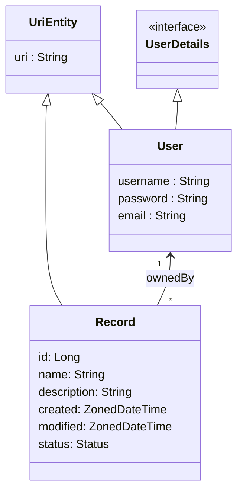

# Spring Boot Template

Template for a Spring Boot project including Spring REST, HATEOAS, JPA, etc. Additional details: [HELP.md](HELP.md)

## Vision

**For** students learning Spring Boot and REST API development
**who** want to practice backend engineering with modern tools
**the project** is a template project
**that** provides user registration, authentication, and secured record management with ownership-based access control
**Unlike** other templates, this one is designed for iterative feature building with BDD (Cucumber) tests driving the development

## Features per Stakeholder

| USER                          | ADMIN                |
|-------------------------------|----------------------|
| Register                      |                      |
| Login                         |                      |
| Create Record                 |                      |
| Retrieve Record               |                      |
| Update Record                 |                      |
| Delete Record                 |                      |

## Entities Model

