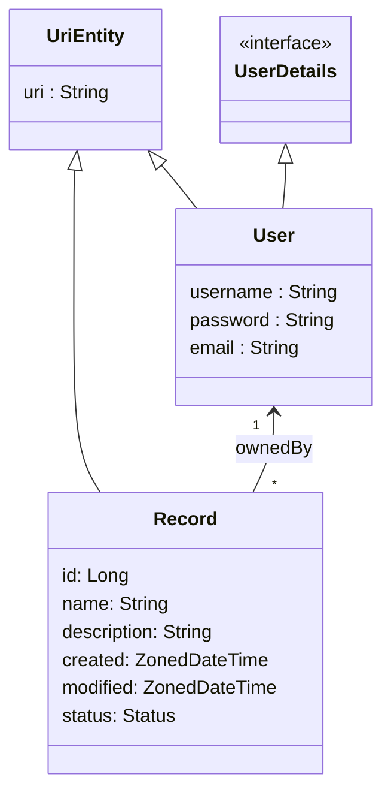

# Spring Boot Template

Template for a Spring Boot project including Spring REST, HATEOAS, JPA, etc. Additional details: [HELP.md](HELP.md)

## Vision

**For** students learning Spring Boot and REST API development
**who** want to practice backend engineering with modern tools
**the project** is a template project
**that** provides user registration, authentication, and secured record management with ownership-based access control
**Unlike** other templates, this one is designed for iterative feature building with BDD (Cucumber) tests driving the development

## Features per Stakeholder

| USER                          | ADMIN                |
|-------------------------------|----------------------|
| Register                      |                      |
| Login                         |                      |
| Create Record                 |                      |
| Retrieve Record               |                      |
| Update Record                 |                      |
| Delete Record                 |                      |

## Entities Model

## AI-Assisted Spec-Driven Development (SDD)

This repository serves as a starter template for **AI-Assisted Spec-Driven Development (SDD)** with **Spring Data REST** and **Cucumber BDD**.

It is pre-configured with agent skills (`skills/`), repository instructions (`AGENTS.md`, `CONVENTIONS.md`), and Aider configuration (`.aider.conf.yml`) to support both:
1. **Full-Capability AI Agents** (OpenCode, Claude Code, Cursor, GitHub Copilot, Windsurf).
2. **Token-Constrained APIs** (Aider paired with Groq free tier - 8K token limits).

For complete stage-by-stage instructions and command workflows, see **[AI_DEVELOPMENT_GUIDE.md](AI_DEVELOPMENT_GUIDE.md)**.

### SDD Agent Skills (`skills/`)
- **`skills/sdd-feature-designer/SKILL.md`**: Draft Cucumber `.feature` specs for Spring Data REST endpoints (<50 lines).
- **`skills/sdd-cucumber-steps/SKILL.md`**: Implement MockMvc step definition classes extending `StepDefs.java`.
- **`skills/spring-datarest-entity/SKILL.md`**: Create JPA `@Entity` classes extending `UriEntity` and `@RepositoryRestResource` interfaces with SpEL row-level security queries.
- **`skills/spring-datarest-hander/SKILL.md`**: Create lifecycle event handlers based on the `@RepositoryEventHandler`.
- **`skills/sdd-bdd-verifier/SKILL.md`**: Run `mvn test -Dtest=CucumberTest` and analyze test failure summaries.
